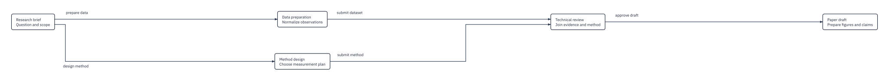

# ClearArcs

ClearArcs turns semantic JSON into deterministic, validated box-and-arrow diagrams with SVG, PDF, layout JSON, and report JSON outputs. It is designed for repeatable technical workflows, system architecture, and paper figures.



## Quick start

ClearArcs requires Node `>=22 <23`.

```sh
npm install @barzan/cleararcs
mkdir -p artifacts
npm exec -- cleararcs render node_modules/@barzan/cleararcs/examples/basic-routing.json --out artifacts/basic-routing
```

The output directory must be new. On success it contains `diagram.svg`, `diagram.pdf`, `layout.json`, and `report.json`. The CLI can be used from any language or environment that can run Node.

```ts
import {layout, svg, pdf} from '@barzan/cleararcs';

const resolved = await layout({
  version: 1,
  nodes: [{id: 'draft', title: 'Draft'}, {id: 'review', title: 'Review'}],
  edges: [{id: 'submit', source: 'draft', target: 'review', label: 'submit'}]
});
if (!resolved.ok) throw new Error(`${resolved.error.code}: ${resolved.error.message}`);
const image = svg(resolved.value);
const document = await pdf(resolved.value);
```

## Examples

| Example | What it demonstrates |
| --- | --- |
| [Basic routing](examples/basic-routing.json) | Branching, joining, labels, and orthogonal routes. |
| [Continuation](examples/continuation.json) | A same-color dotted flow through a text-safe node lane. |
| [Paper architecture](examples/paper-architecture.json) | A synthetic research system with data, control, and feedback paths. |
| [Complex workflow](examples/complex-workflow.json) | A synthetic page-fit stress diagram with references, structured rows, loops, bridges, and continuations. |

Rendered SVG/PDF/layout/report bundles are retained beside each JSON example.

## Printing and LaTeX

Use `layoutGoal: "fit-page"` and physical `page` constraints when the artifact must fit a page. The resolved `print.transform` is applied exactly once by both SVG and PDF exporters. For LaTeX, include the resulting PDF directly:

```tex
\usepackage{graphicx}
\includegraphics{diagram.pdf}
```

ClearArcs does not generate TikZ or LaTeX drawing code.

## How layout works

ClearArcs builds on [ELK Layered](https://eclipse.dev/elk/reference/algorithms/org-eclipse-elk-layered.html), a Sugiyama-style layered method. It does not claim a new layout algorithm or globally optimal layout. Inputs are semantic JSON or calls to the TypeScript/JavaScript API; resolved geometry is validated before export.

The default input bound is 30 nodes and 60 edges. `capacity: "extended"` raises it to 60 nodes and 120 edges. Inputs, colors, geometry, labels, and page constraints are validated. Renderers support ordinary and rich visual modes; see [the API reference](docs/API.md) for their differences.

ClearArcs has no required network service or telemetry. It does not provide arbitrary shapes, an editor, automatic pagination, or a claim of universal readability.

See [usage](docs/USAGE.md), [API details](docs/API.md), [testing](docs/TESTING.md), [the geometry contract](docs/CONTRACT.md), [contributing](CONTRIBUTING.md), [security reporting](SECURITY.md), and [third-party notices](docs/THIRD_PARTY_NOTICES.md).
